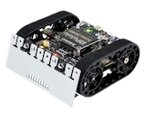

# The Zumo 2040 Challenge!
## Overview
This challenge is meant as a quick low friction way to enter the world of Mini Sumo:
* Utilizes an existing Mini Sumo robot kit.
* No need to design the mechanical or electronic portions of the robot.
* Concentrate on Mini Sumo strategies, algorithms, and code instead.

## Pololu Zumo 2040 Robot

The [Pololu Zumo 2040 Robot](https://www.pololu.com/category/308/zumo-2040-robot) will be used for this challenge. Either of the following versions can be used by contestants. The one to use will depend on whether the contestant wants to build the bot themselves or not:
* **Kit Version**
  * 1 x [Zumo 2040 Robot Kit (No Motors)](https://www.pololu.com/product/5010)
  * 2 x [75:1 Micro Metal Gearmotor HP 6V with Extended Motor Shaft](https://www.pololu.com/product/2215)
* **Preassembled Version**
  * 1 x [Zumo 2040 Robot (Assembled with 75:1 HP Motors)](https://www.pololu.com/product/5012)

## Rules
* Adhere to the **Autonomous 500g Mini Sumo** variant of the [SRS Sumo Rules](https://robothon.org/rules-sumo/).
* No changes to the stock **Zumo 2040 Robot** are currently permitted.
  * No mechanical modifications or additions allowed.
  * No electronic modifications or additions allowed.
* Challengers are **encouraged** to **modify/improve/replace** the stock **software** as much as possible!!

## Goals
* Increase interest in Mini Sumo.
* Compete with the same bots in the [Robothon & More](https://robothon.org/summer-2026-robothon-event/) event on **August 22nd, 2026** in the **Capital Hill** region of Seattle, WA.
* Present a path for at least one of the contestants to get into the design of their own custom Mini Sumo robots that would be competitive in existing Mini Sumo contests such as at the SRS Robothon events.
* Could allow for remote robot competitions:
  * Contestants would submit their custom **.uf2** firmware images to event organizers.
  * Each firmware image submitted would be turned into 2 contestants:
    * Contestant **FirmwareName-A**
    * Contestant **FirmwareName-B**
  * The contest would then be run with exactly 2 physical robots:
    * **Robot-A**
    * **Robot-B**
  * The **FirmwareName-A** contestant would always run on **Robot-A**.
  * The **FirmwareName-B** contestant would always run on **Robot-B**.
  * These 2 contestant versions would be used in an attempt to reduce the influence of one physical robot on the final winner since each submitted firmware gets to compete as both physical robots.
  * **Robot-A** and **Robot-B** used for the official competitions could be pre-assembled versions purchased from Pololu to reduce differences in the bots since they would hopefully be built by the same person who has built many of them in the past resulting in a consistent flow for their construction process.
  * In an ideal situation where one submission's firmware is much better than the others, it would be their **FirmwareName-A** and **FirmwareName-B** contestants that ended up competing in the final.
  * To obtain unique 1st, 2nd, and 3rd place finishers, only a submissions's best result would be kept and the rest discarded (ie. both the **FirmwareName-A** and **FirmwareName-B** contestants cannot end up in the top 3).
* Contest organizers could relax restrictions on electronic changes in the future to allow for additional sensors and/or different mainboards but the mechanical components would still be required to remain stock.
